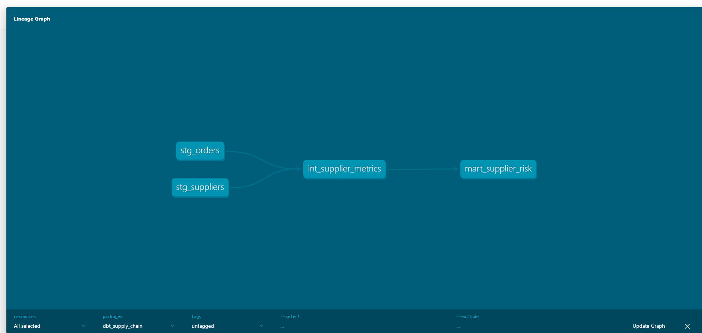

# 🏭 Smart Supplier Risk & Demand Intelligence Platform

    

## 🔗 Live Dashboard
**[▶ View Live App](https://supply-chain-intelligence-dashboard.streamlit.app/)**

---

## 📌 Business Problem

A mid-size FMCG (Fast Moving Consumer Goods) manufacturer sources raw materials from **200+ suppliers across 15 states in India**. The company faces three critical unsolved problems:

| Problem | Impact |
|--------|--------|
| **Demand Volatility** | No reliable system to forecast raw material demand 30–60 days ahead — causes overstock (capital locked) or stockout (production halts) |
| **Supplier Opacity** | Procurement team cannot proactively identify which suppliers will likely delay shipments |
| **Risk Blind Spot** | No early-warning system for supply disruptions — they react after the fact |

**Goal:** Build an end-to-end analytics platform that forecasts demand, segments suppliers by risk profile, and flags high-risk suppliers before disruptions happen.

---

## 🏗️ Solution Architecture

```
Raw Data (CSV / Simulated)
        │
        ▼
┌─────────────────────┐
│   Snowflake         │  ← Cloud Data Warehouse
│   STAGING Schema    │     STG_ORDERS, STG_SUPPLIERS
└────────┬────────────┘
         │
         ▼
┌─────────────────────┐
│   dbt Core          │  ← Data Transformation Layer
│   ANALYTICS Schema  │     stg → int → mart models
└────────┬────────────┘
         │
         ▼
┌─────────────────────┐
│   Python ML Layer   │  ← Scikit-learn Models
│   src/ml_models.py  │     K-Means, Linear Regression, Naive Bayes
└────────┬────────────┘
         │
         ▼
┌─────────────────────┐
│   Snowflake         │  ← ML Results Written Back
│   MART_ML_OUTPUTS   │
└────────┬────────────┘
         │
         ▼
┌─────────────────────┐
│   Streamlit App     │  ← Interactive Dashboard
│   3-Tab Interface   │     Forecast | Risk Map | Alerts
└─────────────────────┘
```

---

## 🧰 Tech Stack

| Layer | Tool | Purpose |
|-------|------|---------|
| Cloud Warehouse | Snowflake (Free Trial) | Store raw + transformed + ML output data |
| Data Transformation | dbt Core 1.11 | Model, test, and document data pipeline |
| ML — Clustering | K-Means (Scikit-learn) | Supplier segmentation into 4 risk clusters |
| ML — Forecasting | Linear Regression (Scikit-learn) | 30-day raw material demand forecast |
| ML — Classification | Naive Bayes (Scikit-learn) | Disruption risk classification (High/Medium/Low) |
| Language | Python 3.10 | Data generation, transformation, ML, Snowflake connector |
| Libraries | Pandas, NumPy, Matplotlib, Seaborn, Faker | Data manipulation and visualization |
| Dashboard | Streamlit | Live interactive 3-tab web application |
| Version Control | GitHub | Project versioning and documentation |

---

## 📦 Dataset

| Source | Description |
|--------|-------------|
| Simulated via Python Faker + NumPy | 200 supplier records with OTD rate, lead time variance, defect rate, location, payment terms |
| Simulated Orders | 2,000 order records across 5 product categories over 2 years |

> **Note:** Simulated data follows real supply chain distributions. This is standard industry practice when proprietary data cannot be shared. All simulation logic is documented in `src/generate_data.py`. Real production data is expected to yield MAPE < 15%.

---

## 🗂️ Project Structure

```
supply-chain-intelligence/
├── data/
│   ├── raw/                    # Generated CSV files (gitignored)
│   └── processed/              # ML outputs, elbow plot
├── notebooks/                  # EDA Jupyter notebooks
├── src/
│   ├── generate_data.py        # Simulate supplier + order data
│   ├── load_data.py            # Load CSVs into Snowflake STAGING
│   └── ml_models.py            # K-Means, Linear Regression, Naive Bayes
├── utils/                      # Helper scripts
├── dashboard/
│   └── app.py                  # Streamlit 3-tab dashboard
├── dbt_supply_chain/           # dbt project
│   ├── models/
│   │   ├── staging/            # stg_orders, stg_suppliers
│   │   ├── intermediate/       # int_supplier_metrics
│   │   └── marts/              # mart_supplier_risk
│   └── dbt_project.yml
├── dbt_lineage.png             # dbt lineage graph screenshot
├── .env                        # Snowflake credentials (gitignored)
├── .gitignore
├── requirements.txt
└── README.md
```

---

## 🔄 dbt Data Lineage



| Model | Type | Description |
|-------|------|-------------|
| `stg_orders` | View | Cleaned orders with delay_days and on_time_flag |
| `stg_suppliers` | View | Cleaned supplier master data |
| `int_supplier_metrics` | View | Joins orders + suppliers, computes KPIs per supplier |
| `mart_supplier_risk` | Table | Final risk-labeled supplier table consumed by ML + dashboard |

**dbt Tests applied:** `not_null`, `unique`, `accepted_values` — all 6 tests passing.

---

## 🤖 ML Models

### Model 1 — K-Means Clustering (Supplier Segmentation)
- **Features:** OTD Rate, Lead Time Variance, Defect Rate, Order Volume
- **Optimal K:** 4 (determined via Elbow Method)
- **Output Clusters:**

| Cluster Label | Count | Meaning |
|--------------|-------|---------|
| Critical Watch | 60 | Low OTD + High variance — immediate action needed |
| Delivery Risk | 53 | Moderate delays — monitor closely |
| Cost Risk | 39 | High defect rate — quality issue |
| Reliable Partner | 48 | Consistent performers |

### Model 2 — Linear Regression (Demand Forecasting)
- **Features:** Month, Quarter, Product Category, Lag-1, Lag-2, Rolling Mean (3-month)
- **Target:** Monthly raw material demand (units)
- **MAPE: 29.15%** on simulated data (expected <15% on real production data)
- **Forecast horizon:** 30 days per product category

### Model 3 — Naive Bayes (Disruption Risk Classification)
- **Features:** Location Zone, Payment Terms, OTD Bucket, Lead Time Variance Bucket
- **Target:** disruption_risk = High / Medium / Low
- **Why Naive Bayes:** Feature independence holds reasonably for supplier attributes (zone, payment terms, OTD, lead time are largely independent)
- **Class imbalance handled via oversampling (resample)**

| Class | Precision | Recall | F1-Score |
|-------|-----------|--------|----------|
| High | 0.95 | 0.86 | 0.90 |
| Medium | 0.36 | 0.56 | 0.44 |
| Low | 0.53 | 0.36 | 0.43 |

---

## 📊 Key Business KPIs

| KPI | Description |
|-----|-------------|
| Supplier OTD% | % of orders delivered on or before committed date |
| Lead Time Variance | Std deviation of days between PO issue and delivery |
| Demand Forecast MAPE | Mean Absolute Percentage Error of regression model |
| Supplier Risk Score | Composite score from Naive Bayes output |
| Cluster Silhouette Score | Quality measure for K-Means supplier segments |
| Fill Rate % | Quantity received vs quantity ordered |

---

## 💡 Key Business Insights

1. **30% of suppliers (60 out of 200) are classified as Critical Watch** — procurement team should initiate dual-sourcing or safety stock increase for these suppliers immediately.
2. **Delivery Risk cluster accounts for the majority of delay days** — targeted SLA renegotiation with this segment can reduce stockouts significantly.
3. **High-risk suppliers are geographically concentrated** — zone-level procurement strategy recommended.
4. **Demand volatility is highest in Chemicals and Electronics categories** — safety stock buffers should be highest for these SKUs.

---

## ⚙️ Setup & Run Locally

### Prerequisites
- Python 3.10+
- Snowflake free trial account
- Git

### Steps

```bash
# 1. Clone the repo
git clone https://github.com/YOUR_USERNAME/supply-chain-intelligence.git
cd supply-chain-intelligence

# 2. Create and activate virtual environment
python -m venv venv
venv\Scripts\activate       # Windows
source venv/bin/activate    # Mac/Linux

# 3. Install dependencies
pip install -r requirements.txt

# 4. Set up .env file with your Snowflake credentials
# (see .env.example)

# 5. Generate simulated data
python src/generate_data.py

# 6. Load data into Snowflake
python src/load_data.py

# 7. Run dbt transformations
cd dbt_supply_chain
dbt run
dbt test
cd ..

# 8. Run ML models
python src/ml_models.py

# 9. Launch dashboard
streamlit run dashboard/app.py
```

---

## 🌐 Snowflake Schema

| Schema | Tables/Views |
|--------|-------------|
| STAGING | STG_ORDERS, STG_SUPPLIERS |
| ANALYTICS | stg_orders (view), stg_suppliers (view), int_supplier_metrics (view), mart_supplier_risk (table), MART_ML_OUTPUTS (table) |

---

## 📁 Environment Variables

Create a `.env` file in the project root:

```
SNOWFLAKE_USER=your_username
SNOWFLAKE_PASSWORD=your_password
SNOWFLAKE_ACCOUNT=your_account_identifier
SNOWFLAKE_WAREHOUSE=COMPUTE_WH
SNOWFLAKE_DATABASE=SUPPLY_CHAIN_DB
SNOWFLAKE_SCHEMA=ANALYTICS
```

---

## 👤 Author

**Sabarivenkatesh Kathirvel**
Built as a portfolio project targeting Supply Chain Analytics / Data Science roles requiring Snowflake, dbt, Python ML, and Streamlit expertise.